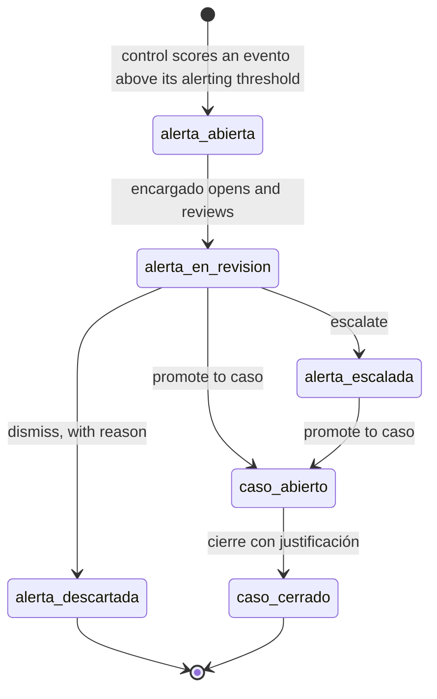

# Flujo del encargado de cumplimiento

The human half of the system. It exists because of the design axiom that **a human always decides** — computers cannot be held accountable, and the platform is not a mechanism of legal determination. Every transition below is caused by a person, never by the engine.

## Lifecycle

Only the first transition is produced by the engine, and it produces a record — not a decision.

## What each step records

| Step | Recorded |
|---|---|
| alerta raised | the control definition that ran, the evento, the `score`, the band, and the full `breakdown[]` **as computed at that moment** |
| review | that the encargado opened it, who, when |
| dismiss | actor, timestamp, written reason |
| escalate | actor, timestamp (destination unresolved — see SPEC Open Questions) |
| promote to caso | actor, timestamp |
| **cierre con justificación** | actor, timestamp, **written reason (required)** |

Records carry actor and timestamp and are **not editable through the UI**. A full append-only evidence log with point-in-time enrichment storage is a SHOULD, deliberately outside this contract.

## Why the cierre is the point

Alertas prove the model was watching. The **cierre con justificación** proves what the organization *decided despite a warning* — and that is where liability actually lives. It is the highest-value evidence the system produces, and the only place where the model can be observed changing a decision rather than archiving one.

It is also, structurally, a data stream of its own: one gerente overriding forty times is itself a señal. Running a meta-control over the override stream is the concrete mechanism for making **non-action visible** — deliberately a SHOULD (cluster H), not part of this contract.

## Authentication

Better-Auth gives the closing action a named actor (CAP-9). **One role is enough for the slice.** A second role — and with it an escalation path for the case where the encargado cannot independently close an alerta about the person who signs her paycheck — is a COULD, and the independence problem is carried forward as an open question in SPEC.md rather than solved here.

## Boundaries

- No transition happens automatically. No blocking, no enforcement, no second-approval requirement — that half of the preventivo axis is a non-goal.
- Dismissal is a decision, not a deletion: a dismissed alerta remains in the evidence trail.
